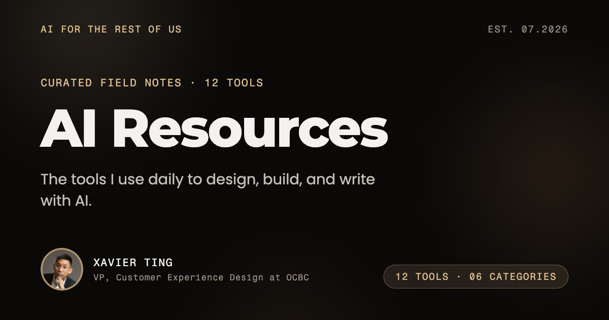

# AI Resources — AI for the rest of us

A curated log of the AI tools I use daily to design, build, and write.
Ten entries, each with why it matters, when to reach for it, and how to run it.
No hype, no affiliate links.

Curated by **[Xavier Ting](https://www.linkedin.com/in/xavierting/)** — VP, Customer
Experience Design at OCBC · AI & Design Leader.
[LinkedIn](https://www.linkedin.com/in/xavierting/) · [X](https://x.com/xaviertingai)



---

## What this is

Plain HTML, CSS and JavaScript. No framework, no dependencies, no build step at
deploy time. Open `index.html` and it works.

| File | What it is |
|---|---|
| `tools.js` | **The curation.** One object per tool — this is the only file to edit to add or change an entry. |
| `site.js` | Site identity and the canonical URL. One line to change after deploying. |
| `index.html` | The card grid, category tabs, hero. The "The log" tab. |
| `ai-101.html` | The "AI 101" tab: the Artificial Intelligence 101 course (56 terms, 9 chapters). **Hand-owned** — the generator never touches it. |
| `curator.html` | The "The curator" tab: bio and why the site exists. **Hand-owned.** |
| `101.css` / `101.js` | The course page's styles (over `styles.css` tokens) and behaviour (chapter router + interactives). |
| `theme.js` | The light/dark switch, shared by every page (light default, localStorage, art swap). |
| `assets/101/` | The course artwork in both palettes: dark recolours + the original light set in `light/`, both emitted by `assets/101/recolor.py`. |
| `tools/<slug>.html` | One static, indexable page per tool. **Generated — don't hand-edit.** |
| `styles.css` | The whole visual system, including the shared `.site-tabs` page nav. |
| `app.js` | Filtering, copy-to-clipboard, motion. Progressive enhancement over static HTML. |
| `generate-seo.mjs` | Regenerates the static pages, `sitemap.xml`, `robots.txt` and `llms.txt`. |

## Adding or changing a tool

1. Edit `tools.js` — add one object to `TOOLS`, bump `LOG_UPDATED`.
2. Run the generator so search engines see it:

   ```bash
   node generate-seo.mjs
   ```

3. Regenerate `og-image.png` if the tool count changed (it's a rendered card).

Skipping step 2 leaves the static pages, sitemap and `llms.txt` stale — a new
tool would be invisible to search.

## Deploying

Static upload — drag the folder into Netlify, or connect the repo to Vercel.
No build command, no output directory.

**One required step after your first deploy:** put the real URL in `SITE.url`
inside `site.js` and re-run `node generate-seo.mjs`. Every canonical tag,
`og:url`, sitemap entry and JSON-LD reference follows from it, and a wrong
canonical URL actively suppresses search ranking.

## Docs

- [`SEO.md`](SEO.md) — what's built for search and answer engines, plus the
  post-deploy checklist
- [`DESIGN.md`](DESIGN.md) — the visual system ("Signal Field": warm dark ground,
  drifting aurora, one gold accent)
- [`PRODUCT.md`](PRODUCT.md) — who this is for and what must stay true
- [`assets/README.md`](assets/README.md) — how to swap the portrait

## Built with the tools it lists

Impeccable ran its design detector on every edit. Superpowers drove the
brainstorm → plan → build flow. Chrome DevTools MCP verified every render.

## Licence

Code: MIT — take the pattern and build your own log.
Written content, curation and portrait: © Xavier Ting. Please credit if you quote it.
